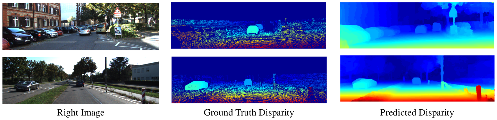

# Stereo Image Depth Estimation

Depth estimation in stereo images using [Pyramid Stereo Matching Network](http://openaccess.thecvf.com/content_cvpr_2018/papers/Chang_Pyramid_Stereo_Matching_CVPR_2018_paper.pdf)(CVPR 2018) by Chang et al. on [KIITI autonomous driving dataset](http://www.cvlibs.net/datasets/kitti/eval_stereo_flow.php?benchmark=stereo). This code was adapted from this [code](https://github.com/JiaRenChang/PSMNet).

## Requirements
```
Python 3.6
PyTorch 0.4.0
```

## Some outputs



